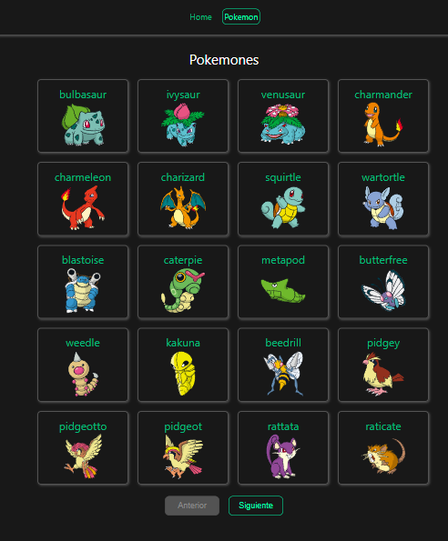
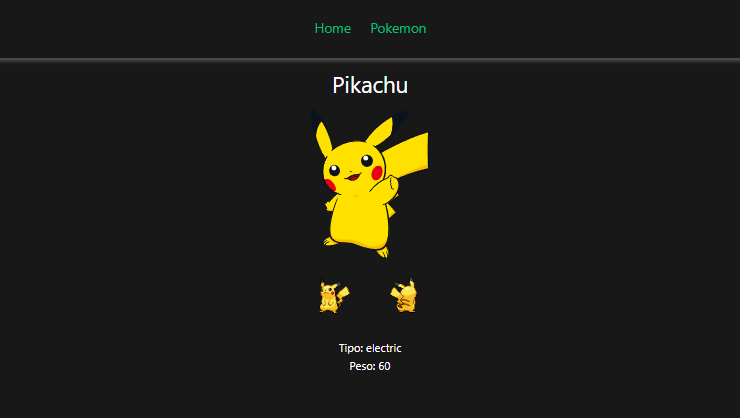

# vue-poke-app

Esta app está desarrollada con vue.

Consumo la PokeAPI usando axios, cuenta con paginación y muestra el detalle de cada pokemon seleccionado.

## Pokemones

    <picture>
      
    </picture>

  <picture>
    
  </picture>
  <picture>
    
  </picture>

